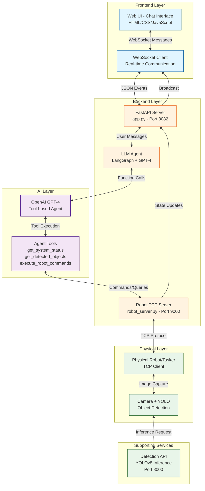

# AdaptiBot - System Architecture

## Executive Summary

**AdaptiBot** is an AI-powered robotic arm control system that enables users to interact with a physical robot through natural language conversation. Instead of requiring technical knowledge or programming skills, operators simply chat with the system using commands like "put the red can in BOX1," and the AI agent translates these requests into precise robotic movements. The system provides real-time visual feedback showing detected objects with their colors, active storage boxes, and live status updates, making robot control accessible to non-technical users while maintaining safety and precision through intelligent clarification and validation mechanisms.

---

## System Architecture Diagram



---

## Data Flow Diagram

```
┌─────────────┐
│    User     │
│ "Put red    │
│  can in     │
│   BOX1"     │
└──────┬──────┘
       │
       ▼
┌─────────────────────────────────────────────────────────┐
│                    FRONTEND (Browser)                    │
│  ┌────────────┐  ┌──────────────┐  ┌─────────────┐     │
│  │ Chat Panel │  │ Objects List │  │ Box Status  │     │
│  └────────────┘  └──────────────┘  └─────────────┘     │
│         WebSocket Connection (Real-time)                │
└─────────────────────────┬───────────────────────────────┘
                          │
                          ▼
┌─────────────────────────────────────────────────────────┐
│              BACKEND (FastAPI Server)                    │
│                                                           │
│  ┌────────────────────────────────────────────────┐     │
│  │           LangGraph Agent (GPT-4)              │     │
│  │                                                 │     │
│  │  1. Analyze: "red can" → need object coords    │     │
│  │  2. Call: get_detected_objects()               │     │
│  │  3. Call: get_system_status() → BOX1 coords    │     │
│  │  4. Execute: execute_robot_commands(           │     │
│  │       grab="100 50 100",                       │     │
│  │       drop="50 60 14"                          │     │
│  │     )                                          │     │
│  └────────────┬───────────────────────────────────┘     │
│               │                                          │
│  ┌────────────▼───────────────────────────────────┐     │
│  │        Robot Server (State Manager)            │     │
│  │  - Maintains object list                       │     │
│  │  - Tracks box contents                         │     │
│  │  - Sends TCP commands                          │     │
│  │  - Broadcasts updates                          │     │
│  └────────────┬───────────────────────────────────┘     │
└───────────────┼─────────────────────────────────────────┘
                │ TCP Socket (Port 9000)
                ▼
┌─────────────────────────────────────────────────────────┐
│              PHYSICAL ROBOT / TASKER                     │
│                                                           │
│  1. Receives: {"cmd_list": ["GRAB 100 50 100",          │
│                              "DROP 50 60 14"]}           │
│  2. Responds: {"cmd": "stop_listen"} (ack)              │
│  3. Executes: Move arm → Grab → Move → Drop             │
│  4. Responds: {"cmd": "start_listen"} (done)            │
│                                                           │
│  On request:                                             │
│  5. Captures image → Sends to Detection API              │
│  6. Receives: [{"class": "can", "color": "red",         │
│                  "coords": "100 50 100"}, ...]           │
│  7. Returns: {"objects": ["0 3 100 50 100", ...]}       │
└─────────────────────────────────────────────────────────┘
```

---

## How It Works

### Business/Product View

AdaptiBot transforms complex robotic operations into simple conversations, enabling warehouse workers, laboratory technicians, or production line operators to control robotic arms without technical training. The system intelligently interprets natural language commands ("move all blue objects to BOX2"), visually confirms what objects it sees in the workspace, and asks clarifying questions when needed ("I see two blue items - did you mean the blue cup or blue ball?"). This reduces errors, speeds up training, and makes automation accessible to teams without robotics expertise. The real-time visual interface displays the robot's "understanding" of the scene - showing detected objects with colors, box locations, and operation status - providing transparency and building operator confidence in the AI-controlled system.

### Technical Architecture

**Three-Layer Architecture:**

- **Presentation Layer**: WebSocket-based single-page application providing real-time chat interface, object visualization panels, and connection status indicators. Uses Web Speech API for optional voice input and maintains bidirectional event streaming for instant UI updates.

- **Intelligence Layer**: LangGraph-orchestrated agent powered by GPT-4 with three specialized tools: `get_system_status()` retrieves robot connectivity and box configurations, `get_detected_objects()` queries the camera for current scene state, and `execute_robot_commands()` sends coordinate-based GRAB/DROP instruction pairs. The agent maintains conversation context, validates requests against actual scene state, and follows safety-first protocols by requesting clarification rather than making assumptions.

- **Control Layer**: Asynchronous TCP server (port 9000) managing stateful communication with the physical robot, implementing command/response synchronization with threading locks, tracking object locations and box contents in memory, and broadcasting state changes to all connected WebSocket clients for real-time UI synchronization.

**Key Technical Decisions:**

- **Tool-based Agent Pattern**: GPT-4 uses function calling to dynamically select appropriate tools based on user intent, enabling flexible multi-step reasoning (e.g., first checking system status, then getting objects, then executing commands) without rigid workflow constraints.

- **Stateful TCP Protocol**: Custom JSON-based protocol where robot acknowledges commands with `stop_listen`, executes movements, and confirms completion with `start_listen`, ensuring sequential execution prevents race conditions and state corruption.

- **Zero-Database Architecture**: All state maintained in memory within Robot Server singleton, optimized for single-robot deployment with sub-50ms response times and simplified deployment without database infrastructure overhead.

- **Color-Aware Detection Pipeline**: YOLOv8 model trained on zero-shot auto-labeled data (using OWL-ViT) combined with HSV color analysis enables differentiation like "red can vs blue can" critical for sorting operations, with 9-color classification (black/white/grey/red/blue/green/cyan/magenta/yellow) mapped to discrete IDs.

### Agent Tool Flow

```
User: "put the red can in BOX1"
    ↓
┌───────────────────────────────────────────────────────┐
│ GPT-4 Decision: Need current state                    │
│ Action: Call get_system_status()                      │
└───────────────────────────────────────────────────────┘
    ↓
┌───────────────────────────────────────────────────────┐
│ Tool Response:                                         │
│ - Robot: Connected                                     │
│ - BOX1: "50 60 14"                                     │
│ - BOX2: "150 60 14"                                    │
│ - BOX3: "250 60 14"                                    │
│ - Objects in scene: 7                                  │
└───────────────────────────────────────────────────────┘
    ↓
┌───────────────────────────────────────────────────────┐
│ GPT-4 Decision: Need object coordinates               │
│ Action: Call get_detected_objects()                   │
└───────────────────────────────────────────────────────┘
    ↓
┌───────────────────────────────────────────────────────┐
│ Tool Response:                                         │
│ - red can at (100, 50, 100)                           │
│ - blue cup at (150, 50, 95)                           │
│ - green ball at (200, 45, 102)                        │
│ - ... (4 more objects)                                │
└───────────────────────────────────────────────────────┘
    ↓
┌───────────────────────────────────────────────────────┐
│ GPT-4 Decision: Clear match found, execute            │
│ Action: Call execute_robot_commands(                  │
│    grab_coords=["100 50 100"],                        │
│    drop_coords=["50 60 14"]                           │
│ )                                                      │
└───────────────────────────────────────────────────────┘
    ↓
┌───────────────────────────────────────────────────────┐
│ Robot Execution:                                       │
│ 1. Send TCP: {"cmd_list": ["GRAB...", "DROP..."]}    │
│ 2. Robot ACKs: {"cmd": "stop_listen"}                │
│ 3. Robot executes movement (3-4 seconds)              │
│ 4. Robot completes: {"cmd": "start_listen"}          │
│ 5. Update state: Remove object, add to BOX1           │
│ 6. Broadcast to UI: objects list + box contents       │
└───────────────────────────────────────────────────────┘
    ↓
┌───────────────────────────────────────────────────────┐
│ GPT-4 Response: "Done! I placed the red can in BOX1." │
└───────────────────────────────────────────────────────┘
```

---

## Technology Stack

### Frontend
- **HTML5** - Semantic markup with ARIA accessibility
- **CSS3** - Grid/Flexbox responsive layouts, CSS variables for theming
- **Vanilla JavaScript** - ES6+ with async/await, no framework dependencies
- **WebSocket API** - Bidirectional real-time communication
- **Web Speech API** - Optional voice command input

### Backend
- **FastAPI** - Modern async web framework with automatic OpenAPI documentation
- **Uvicorn** - Lightning-fast ASGI server with WebSocket support
- **LangChain** - LLM framework providing tool abstractions and message handling
- **LangGraph** - Stateful agent orchestration with graph-based execution flow
- **OpenAI Python SDK** - GPT-4 integration with function calling
- **asyncio** - Python coroutine-based concurrency for I/O operations

### AI/ML
- **GPT-4** (gpt-4.1) - Natural language understanding and tool selection
- **YOLOv8n** - Real-time object detection (nano model for inference speed)
- **OWL-ViT** - Zero-shot detection for training data auto-labeling
- **OpenCV** - Image processing and color analysis
- **PyTorch** - ML model inference backend

### Infrastructure
- **Docker** + **Docker Compose** - Containerization and service orchestration
- **TCP Sockets** - Low-latency robot communication protocol
- **Git** - Version control with feature branch workflow

---

## Communication Protocols

### WebSocket Message Types (Frontend ↔ Backend)

**Client → Server:**
```json
{"type": "message", "content": "user command text"}
{"type": "refresh_objects"}
{"type": "reset_scene"}
```

**Server → Client:**
```json
{"type": "system", "content": "status message"}
{"type": "assistant", "content": "AI response"}
{"type": "command", "content": "executing: GRAB..."}
{"type": "objects", "objects": [{"class_name": "can", "color_name": "red", ...}]}
{"type": "drop_points", "drop_points": [{"label": "BOX1", "coordinates": "50 60 14"}]}
{"type": "box_contents", "boxes": {"BOX1": ["red can"], "BOX2": []}}
{"type": "typing", "isTyping": true}
```

### TCP Protocol (Backend ↔ Robot)

**Backend → Robot:**
```json
{"cmd": "give_objects"}
{"cmd": "start_listen"}
{"cmd_list": ["GRAB x y z", "DROP x y z", "GRAB x y z", "DROP x y z"]}
{"cmd": "reset_objects"}
```

**Robot → Backend:**
```json
{"objects": ["class_id color_id x y z", "class_id color_id x y z", ...]}
{"cmd": "stop_listen"}
{"cmd": "start_listen"}
{"cmd": "set_drop_point", "id": 0, "label": "BOX1", "coordinates": "x y z"}
{"cmd": "clear_drop_points"}
```

---

## Object & Color Classification

### Object Classes (IDs 0-6)
```
0: unknown
1: can
2: duck
3: cup
4: sponge
5: ball
6: vegetable
```

### Color Classes (IDs 0-8)
```
0: black
1: white
2: grey
3: red
4: blue
5: green
6: cyan
7: magenta
8: yellow
```

**Detection Format**: `"class_id color_id x y z"` → e.g., `"1 3 100 50 100"` = red can at (100, 50, 100)

---

## Deployment

### Docker Compose Services

```yaml
robot-chat:
  image: robot-chat-app
  ports:
    - "8082:8082"  # Web UI / WebSocket
    - "9000:9000"  # Robot TCP server
  environment:
    - OPENAI_API_KEY=${OPENAI_API_KEY}
    - ROBOT_SERVER_PORT=9000
    - BACKEND_PORT=8082
  volumes:
    - ./robot_chat_app/backend:/app/backend
    - ./robot_chat_app/frontend:/app/frontend
```

### Environment Variables
```bash
OPENAI_API_KEY=sk-...              # Required for GPT-4
ROBOT_SERVER_HOST=0.0.0.0
ROBOT_SERVER_PORT=9000
BACKEND_HOST=0.0.0.0
BACKEND_PORT=8082
```

### Running the System

```bash
# Start the application
docker-compose up -d

# Access web UI
open http://localhost:8082

# Robot should connect to TCP port 9000
# Or run simulator for testing:
python robot_chat_app/tests/robot_simulator.py
```

---

## System Characteristics

### Performance
- **WebSocket Latency**: <50ms for UI updates
- **Agent Response Time**: 1-3 seconds (depends on GPT-4 API)
- **Robot Command Execution**: 3-4 seconds per GRAB/DROP pair
- **Object Detection**: ~200ms (YOLO inference on GPU)
- **Concurrent Users**: Unlimited observers (broadcast pattern)

### Safety Features
- **Clarification Over Assumption**: Agent asks questions if request is ambiguous
- **State Validation**: Always checks current objects before executing
- **Sequential Execution**: One command at a time prevents collisions
- **Connection Monitoring**: UI displays robot connection status
- **Error Handling**: Graceful failures with user-friendly messages

### Scalability Limitations
- **Single Robot**: Current architecture supports one robot (TCP singleton)
- **In-Memory State**: No persistence across restarts
- **Synchronous Execution**: Commands processed sequentially, not in parallel
- **OpenAI API Dependency**: Requires internet and API availability

---

## File Structure

```
adaptibot/
├── robot_chat_app/
│   ├── backend/
│   │   ├── app.py                 # FastAPI server + WebSocket handler
│   │   ├── robot_server.py        # TCP server for robot communication
│   │   ├── llm_agent.py           # LangGraph agent with GPT-4 tools
│   │   └── requirements.txt       # Python dependencies
│   ├── frontend/
│   │   ├── index.html             # UI structure
│   │   ├── script.js              # WebSocket client + event handling
│   │   └── style.css              # Responsive design + animations
│   ├── tests/
│   │   └── robot_simulator.py     # Mock robot for testing
│   ├── docker-compose.yml         # Service orchestration
│   ├── Dockerfile                 # Container definition
│   └── .env                       # Configuration secrets
├── detection_api/
│   ├── app.py                     # YOLO inference service
│   ├── color_utils.py             # HSV color analysis
│   └── weights/best.pt            # Trained YOLOv8 model
└── yolo_detect/
    ├── auto_label_zeroshot.py     # OWL-ViT auto-labeling
    └── train_yolo.py              # YOLOv8 training script
```

---

## Key Design Patterns

### 1. Tool-Based Agent Pattern
- LLM selects tools dynamically via function calling
- Tools encapsulate robot operations (status, detection, execution)
- Clear separation: planning (LLM) vs execution (tools)
- Extensible: add new tools without changing agent logic

### 2. Event-Driven Architecture
- WebSocket messages trigger agent processing
- TCP responses trigger state updates
- State changes broadcast to all clients
- Loosely coupled components

### 3. Broadcast State Synchronization
- Single source of truth (Robot Server)
- All clients receive same updates simultaneously
- Optimistic UI updates for responsiveness
- Eventually consistent across all viewers

### 4. Async/Await Throughout
- All I/O operations non-blocking
- Concurrent WebSocket connections
- Parallel tool execution where possible
- Efficient resource utilization

### 5. Lock-Based Concurrency Control
- Command lock prevents simultaneous robot operations
- Ensures command/response integrity
- Prevents race conditions in state updates
- Thread-safe TCP communication

---

## Future Enhancement Opportunities

1. **Multi-Robot Support**: Extend Robot Server to manage multiple TCP connections with robot ID routing
2. **Persistent Storage**: Add database for conversation history, operation logs, and box configurations
3. **Advanced Planning**: Implement multi-step task planning (e.g., "sort all objects by color")
4. **Computer Vision Integration**: Direct camera feed to frontend with live bounding box overlays
5. **Authentication & Authorization**: Add user accounts with role-based permissions
6. **Metrics Dashboard**: Track operation success rates, average execution times, object counts
7. **Offline Mode**: Local LLM support for environments without internet access
8. **Voice-First Interface**: Enhanced voice command recognition with wake word detection

---

## Conclusion

AdaptiBot demonstrates a production-ready integration of modern AI technologies (LLM agents, computer vision) with traditional robotics (TCP protocols, coordinate systems) wrapped in an accessible real-time web interface. The architecture prioritizes safety through intelligent clarification, provides transparency through visual feedback, and maintains performance through async operations and stateful caching. The system successfully bridges the gap between natural human communication and precise robotic control, making automation accessible to non-technical operators.
